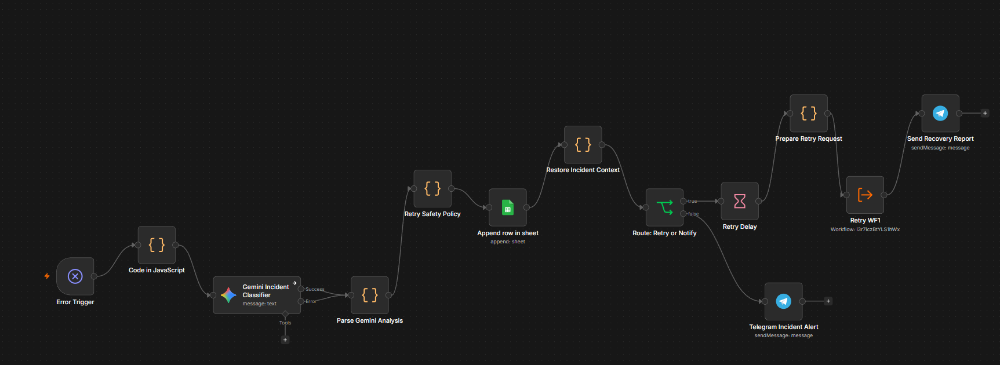
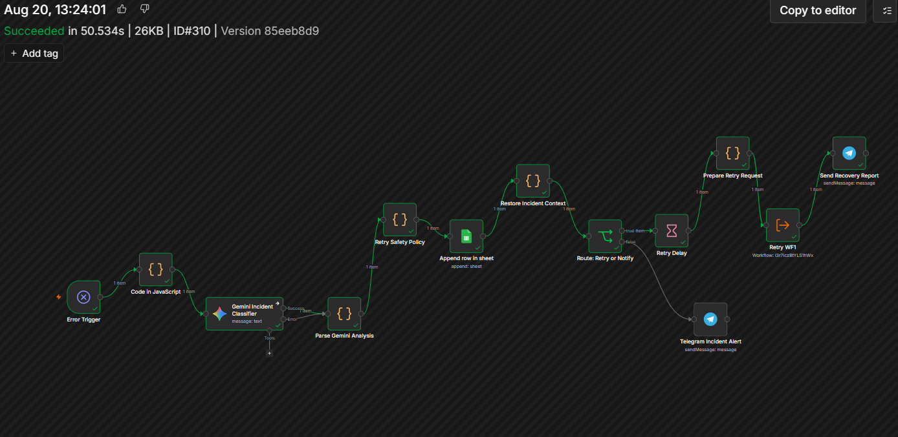
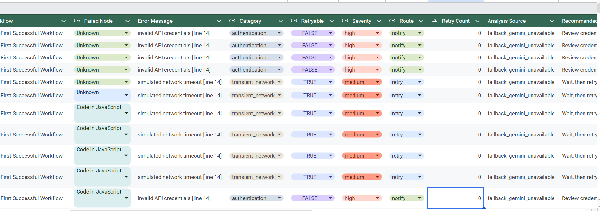
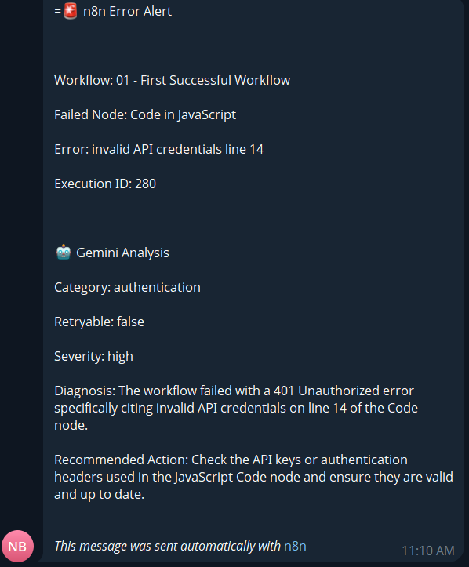
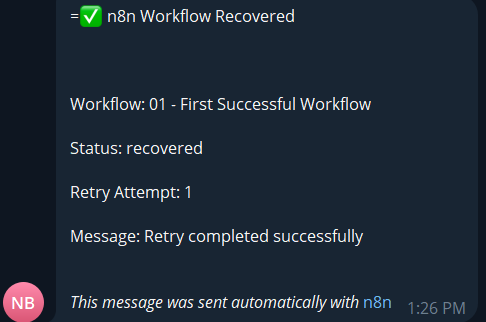

# N8N Sentinel — Workflow Resilience & Self-Healing Monitor

An enterprise-grade, decoupled resilience and incident-response layer built on **n8n**. The system intercepts runtime execution failures from target workflows, classifies root causes via LLM (Google Gemini) with an offline heuristic fallback engine, enforces deterministic retry policies, logs structured audits to Google Sheets, and automates recovery reporting or escalation via Telegram.

---

## 🏛️ System Architecture

The architecture decouples the operational workflow from the incident-response and monitoring plane:

```text
[ WF1: Target Workflow ]
         │ (Fails: ETIMEDOUT / 401 / 429)
         ▼
[ WF2: Error Trigger ] ──► [ Normalize Payload (JS) ]
                                    │
                                    ▼
                     [ Gemini AI / Fallback Classifier ]
                                    │
                                    ▼
                         [ Retry Safety Policy ]
                                    │
                                    ▼
                     [ Append Row to Google Sheets ]
                                    │
                     [ Restore Incident Context ]
                                    │
                 ┌──────────────────┴──────────────────┐
                 ▼ (route == 'retry')                  ▼ (route == 'notify')
        [ Wait 30s Delay ]                     [ Telegram Incident Alert ]
                 │                                (Immediate Escalation)
        [ Prepare Retry Payload ]
                 │
        [ Execute WF1 (isRetry=true) ]
                 │
    [ Telegram Recovery Report ]
```

---

## ⚙️ Core Engineering Mechanisms

### 1. Dual-Engine Error Classification (AI + Fallback)
* **LLM Engine:** Diagnoses raw stack traces via `gemini-3-flash-preview` into strict JSON categories (`transient_network`, `rate_limit`, `authentication`, `configuration`, `invalid_data`).
* **Deterministic Fallback Engine:** If Gemini encounters quota exhaustion (`429`) or API downtime, an internal regex-based heuristic immediately takes over (`fallback_gemini_unavailable`) without halting the pipeline.

### 2. Zero-Trust Policy Enforcement
* **AI Advises, Code Decides:** The LLM does not possess execution authority. The `Retry Safety Policy` enforces a deterministic decision via JavaScript:
  * **Allowlist:** Only `transient_network` and `rate_limit` are permitted to enter retry routines.
  * **Circuit Breaker:** Hard cap of maximum 2 retry attempts (`retryCount < 2`).
  * **Immediate Escalation:** Unrecoverable faults (`authentication`, `invalid_data`, `configuration`) are routed directly to human escalation (`notify`).

### 3. State Preservation Across Sinks
* Writing incident audits to Google Sheets replaces downstream workflow JSON with ingestion metadata.
* Engineered a dedicated **Context Restoration Node** (`$items('Retry Safety Policy', 0, 0)`) to rehydrate the triage context into pipeline memory before conditional routing.

---

## 📊 Incident Triage Matrix

| Error Signature | Classified Category | Retry Allowed? | Automated Remediation |
| :--- | :--- | :--- | :--- |
| `ETIMEDOUT`, `ECONNRESET`, `503` | `transient_network` | **Yes** | 30s Wait Delay ➔ Re-execute WF1 ➔ Send Recovery Report |
| `429 Too Many Requests` | `rate_limit` | **Yes** | Backoff delay execution within max attempt limit |
| `401 Unauthorized`, `403 Forbidden` | `authentication` | **No** | Halt retry ➔ Immediate Telegram Incident Alert |
| Malformed payload / Bad credentials | `configuration` / `invalid_data` | **No** | Halt retry ➔ Immediate Telegram Incident Alert |

---

## 📸 System Validation & Execution Proof

### 1. Monitoring Plane Pipeline (WF2)
Complete execution pipeline showing error interception, dual-triage, audit logging, and routing.


### 2. Runtime Execution Success
Real-time execution log demonstrating successful end-to-end recovery handling under 50 seconds.


### 3. Structured Audit Trail (Google Sheets)
Empirical test records capturing runtime payloads, failure signatures, classification sources, and remediation routes.


### 4. Alerting & Self-Healing Telemetry (Telegram)
* **Incident Escalation (Route: Notify):** Dispatches root-cause diagnosis and actionable recommendations.
* **Recovery Confirmation (Route: Retry):** Verifies downstream target recovery without human intervention.

| Human Intervention Alert | Automated Recovery Report |
| :---: | :---: |
|  |  |

---

## 📁 Repository Structure

```text
├── workflows/
│   ├── 01 - First Successful Workflow.json   # Target workflow with simulated failure & retry logic
│   └── 02 - Self-Healing Monitor.json        # Full monitor with Gemini triage, fallback & policy
├── screenshots/                              # Architectural diagrams & empirical run captures
└── README.md
```

---

## 🛠️ Built With

* **Orchestration:** n8n (Self-Hosted)
* **Runtime Logic:** JavaScript (ES6+ within n8n Code Nodes)
* **AI Diagnostics:** Google Gemini (`gemini-3-flash-preview`)
* **Telemetry & Escalation:** Telegram Bot API
* **Audit Persistence:** Google Sheets API
